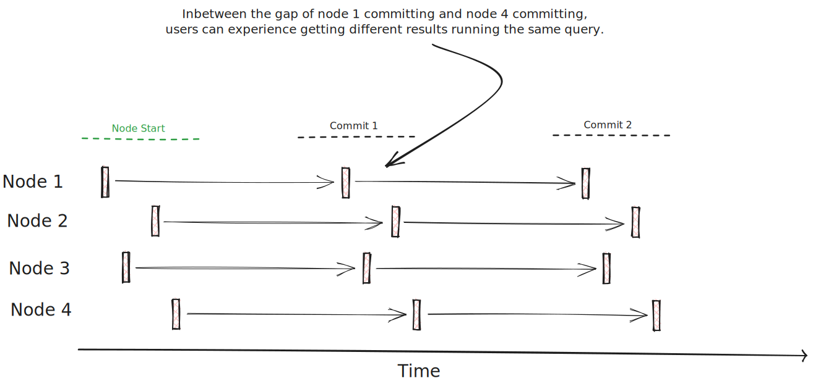
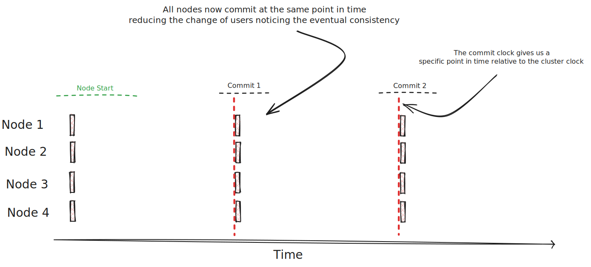

# Deterministic Commit Intervals

A very big issue with lnx's auto commit system is that users may observe data not being reflected by all nodes at
the same time (or close to it) if we have a naive system that just commits every `X` seconds from when it started.

To fix this issue, we have the `CommitClock` which allows an indexer to work out at what point in time it should commit
relative to the cluster clock. So all nodes commit at the same point in time.

#### Without `CommitClock`

#### With `CommitClock`
