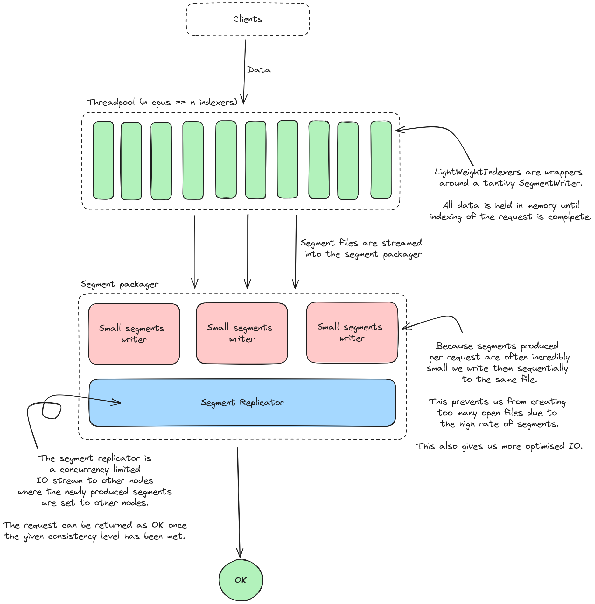
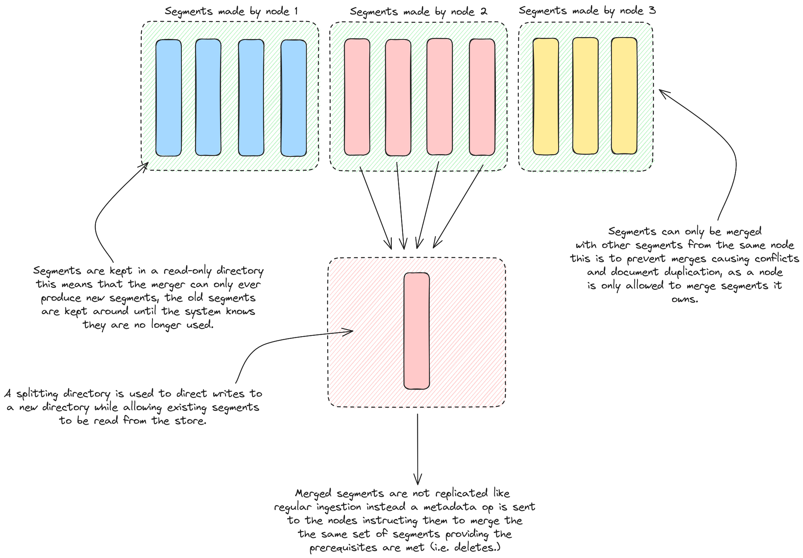

# lnx tantivy

Custom wrappers around the lnx tantivy fork to provide the core handlers.

## Design

### Ingestion
Ingestion is quite different to how tantivy normally ingests documents, internally we use and abuse a lot
of the internal segment writers in tantivy.

This means each request operation is a new segment, and we optimise for that idea. This means segments
are first written to a file stream sequentially in order to avoid an exploding number of open files.

### Merges
Merges are quite special because multiple nodes can merge segments but must follow a set of rules in order
to do so, this helps us prevent additional overhead from handling duplicated documents.

One of the core differences is the resulting segment from the merge is not transferred across the network,
instead a small metadata operation is issued telling the other nodes it may merge a specific set of segments
providing the node has observed a matching set of delete operations.

